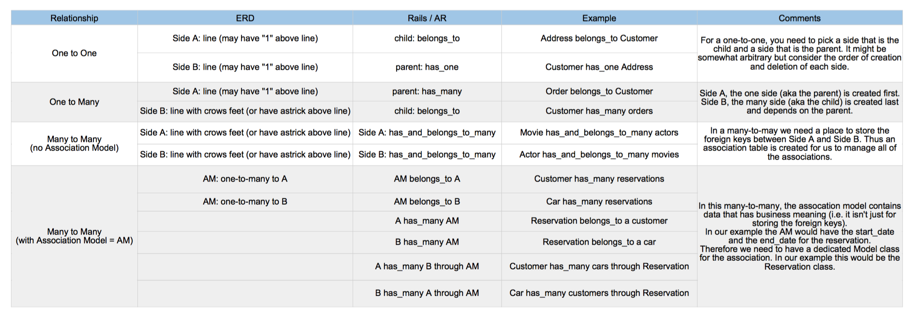
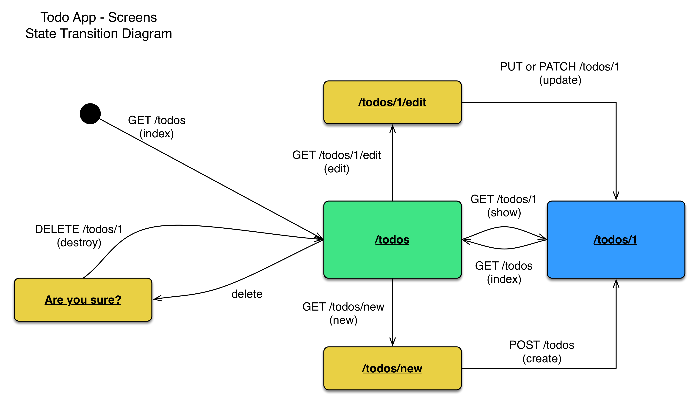
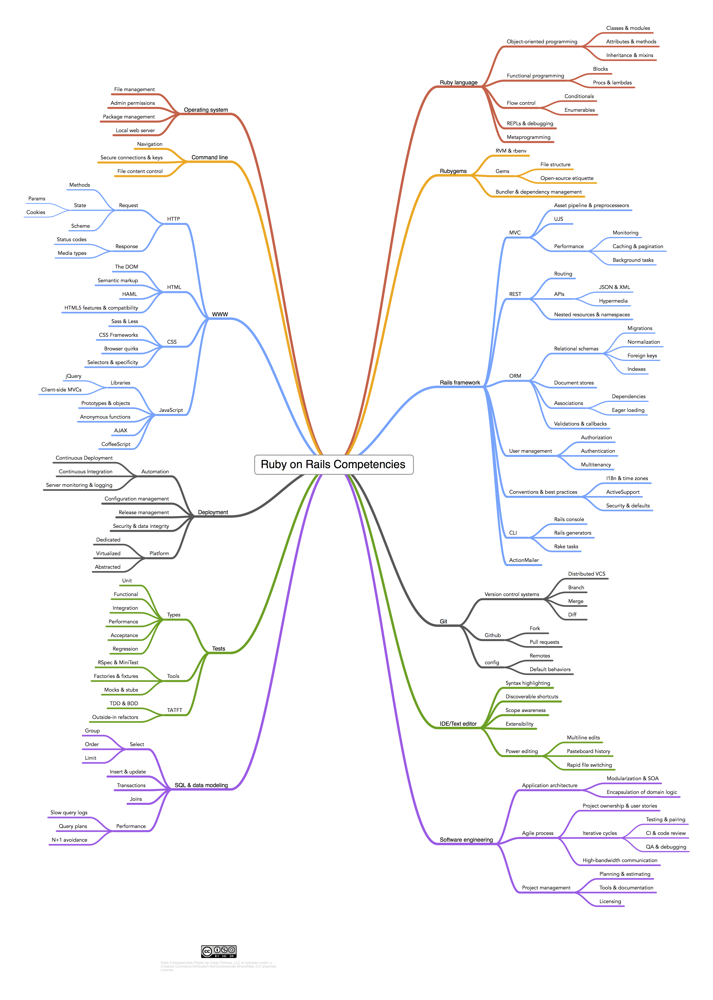

# Rails Diagrams

## Rails Architecture

## CRUD in SQL, REST, and Rails

## Forms, Params, and HTTP Requests

## Rails Associations

## Typical Web Page State Transition Diagram for a RAILS Resource

## Rails Competencies

